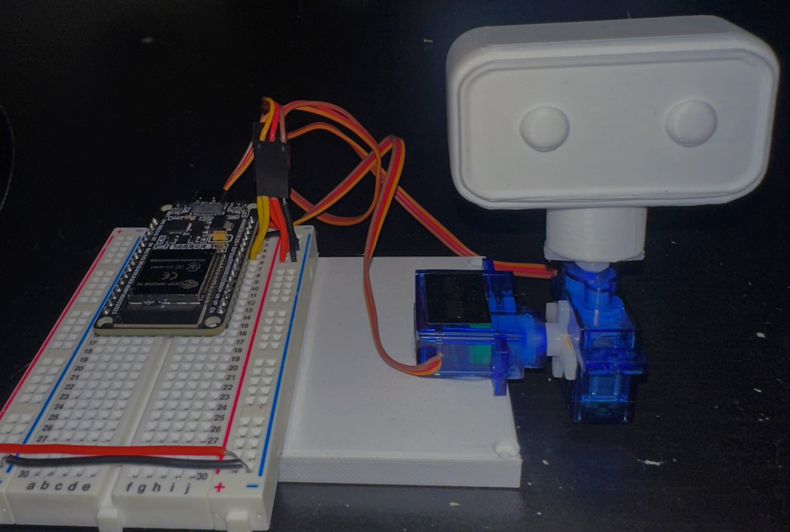
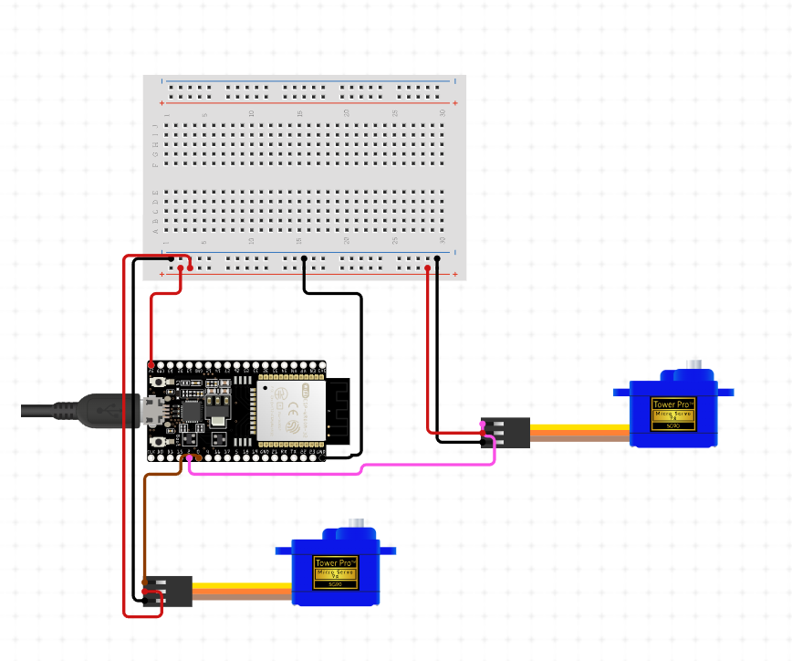

# 📢 CORI Update – v1.7: July 14, 2025

🔌 **HARDWARE INTEGRATION ACHIEVED!** CORI now has a working **ESP32 hardware bridge** with real servo control responding to commands. The physical head moves when colors are detected or joint commands are sent.

**System Status:** ✅ WORKING  
**Integration Level:** ESP32 + Servo Control + Serial Communication  

<div align="center">
  <table>
    <tr>
      <td width="50%" align="center">
        <br><br>
        
        <br><b>Complete Assembly</b><br>
        <em>3D Printed Head with 9G Servos</em>
      </td>
      <td width="50%" align="center">
        <br><br>
        
        <br><b>Breadboard Breakdown</b><br>
        <em>Full Hardware Overview</em>
      </td>
    </tr>
    <tr>
      <td colspan="2" align="center">
        
        <br><b>Physical Head Control</b><br>
        <em>ESP32-Driven Servo Movement with ROS 2 Integration</em>
      </td>
    </tr>
  </table>
</div>


## ✅ What Actually Works

### 🔌 ESP32 Hardware Setup
- ✅ **ESP32-WROOM-32** running the head controller code
- ✅ **Two 9G servos** connected to GPIO12 (pan) and GPIO14 (tilt)
- ✅ **Menu system** with 3 modes: Gazebo, Manual, WiFi
- ✅ **External 5V power** for servos

### 🌐 WiFi Control Interface
- ✅ **WiFi Access Point** creates "CORI_HEAD_CONTROLLER" network
- ✅ **Web interface** at 192.168.4.1 with color buttons
- ✅ **Direct commands** work (red, blue, center, nod, test)
- ✅ **Real-time response** from web clicks to servo movement

### 🤖 ROS 2 Bridge Connection
- ✅ **Serial communication** between ROS and ESP32
- ✅ **Command forwarding** from topics to hardware
- ✅ **Auto-reconnection** when ESP32 disconnects
- ✅ **Hardware feedback** back to ROS topics

### 🎯 Physical Movement
- ✅ **Color-based positioning** (red moves left, blue moves right, etc.)
- ✅ **Smooth servo movement** with gradual transitions
- ✅ **Nodding sequence** for red color detection
- ✅ **Center position** command works

---

## 🏗️ How It's Built

### Hardware Setup
```
ESP32 Pin Connections:
- GPIO12 → Pan servo (left/right)
- GPIO14 → Tilt servo (up/down nodding)
- GPIO2 → Status LED
- 5V/GND → External servo power supply
```

### Software Components
```
cori_hardware/
├── arduino/cori_head_controller.ino  # ESP32 firmware
├── arduino_bridge.py                 # ROS-ESP32 communication
├── hardware_bridge.py                # Integration layer
└── hardware_test.py                  # Testing utilities
```

---

## 🚀 What You Can Do Now

### Launch the Hardware Bridge
```bash
cd cori_ws && ./build.bash
# Select option 6: ESP32 Hardware Bridge
```

### WiFi Control
```
1. Connect to "CORI_HEAD_CONTROLLER" WiFi
2. Open browser to http://192.168.4.1
3. Click color buttons to move head
4. Watch physical servo respond
```

### Test Commands
```bash
# Test basic functionality
ros2 run cori_hardware hardware_test basic

# Send color commands
ros2 topic pub /cori/color_detected std_msgs/String '{data: "red"}'

# Send direct hardware commands
ros2 topic pub /cori/hardware_command std_msgs/String '{data: "CENTER"}'
```

---

## 💫 What This Enables

### **Physical Feedback Loop:**
- Vision system detects color → ROS command → ESP32 → Servo moves
- Physical confirmation that the robot "sees" and "responds"

### **Development Platform:**
- Test hardware commands without full simulation
- Debug servo movement and positioning
- Validate ROS communication protocols

### **User Interaction:**
- Direct control via web interface
- Visual confirmation of robot state
- Foundation for more complex behaviors

---

## 🏆 Achievement Summary

**v1.7 successfully bridges digital commands to physical movement:**

- **Working ESP32 controller** with servo movement
- **Functional WiFi interface** for direct control  
- **ROS 2 communication bridge** that actually connects
- **Physical response system** that moves when commanded

### **Success Metrics:**
- **Physical movement confirmed** - servos respond to commands
- **WiFi control works** - web interface controls hardware
- **ROS integration functional** - topics connect to ESP32
- **Multiple control modes** - Gazebo, Manual, WiFi all work

---

🎯 **Milestone Achieved:** CORI now has **working physical hardware** that responds to software commands.

*First successful bridge between digital intelligence and physical response.*